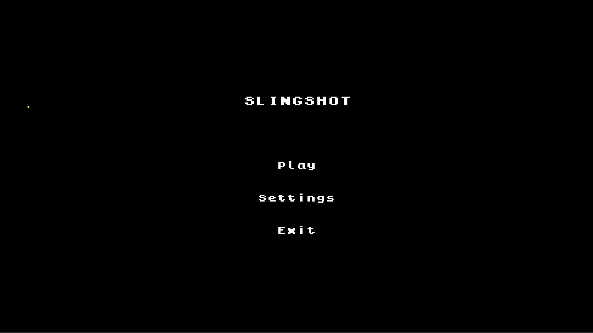
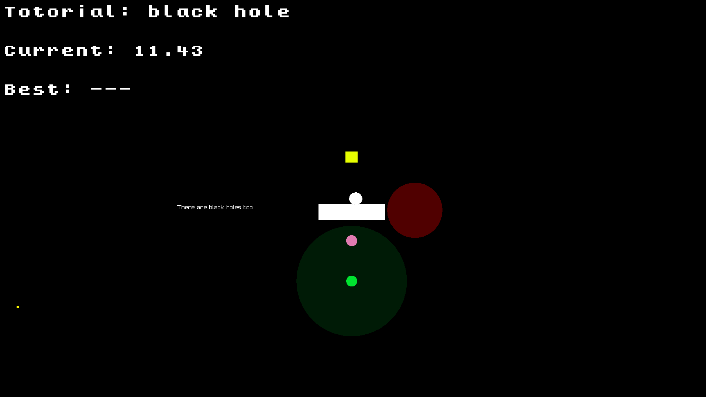
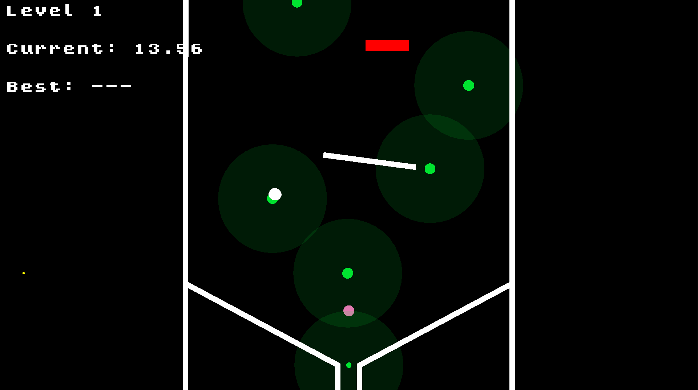

# Slingshot

## Screenshots






## Setup
Update submodules:
```bash
$ git submodule update --init --recursive
```

Apply raylib patch:
```bash
$ cd raylib
$ git apply ../raylib.diff
```

Switch `flecs` version:
```bash
$ cd flecs
$ git checkout v3.2.7
```

## Build

Desktop:
```bash
$ zig build
# for wayland version
$ ./zig-out/bin/slingshot
# for x11 version
$ ./zig-out/bin/slingshot_x11
```

Wasm:
```bash
$ zig build -Dtarget=wasm32-emscripten --sysroot "$PWD/emsdk/upstream/emscripten" -Doptimize=ReleaseFast
$ wasm.sh
```
Everything will be in `wasm` folder.
